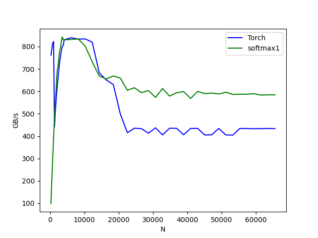

# Learning Triton: softmax for wide rows

A January 2025 learning project on an NVIDIA RTX 3090 (Ampere). I wanted to understand how Triton code maps to GPU execution, and whether I could make row-wise softmax faster than `torch.softmax` for large rows.

This is my working exploration directory, including intermediate variants, commented code and unfinished experiments. I deliberately wrote the experimental code without AI agent assistance to learn through implementation, measurement and debugging.

The path:

1. **Start with fusion.** The [Triton softmax tutorial](https://triton-lang.org/main/getting-started/tutorials/02-fused-softmax.html) keeps a row on-chip to avoid intermediate memory traffic. Increasing the row width runs into on-chip resource limits.
2. **Coordinate chunks with a spinlock.** [softmax2.py](softmax2.py) assigns one program per chunk. Each publishes its maximum and normalizer to global memory, then atomically increments a per-row completion counter. `tl.atomic_cas` polls that counter until all chunks arrive; each program then combines the partial results and normalizes its own chunk. The "spinlock" acts as a per-row barrier. The [saved benchmark](softmax2_bm.png) was slightly faster than PyTorch for some wide rows, despite extra memory traffic, atomics, busy waiting and repeated reductions. That surprised me and made synchronization and block scheduling worth understanding. Spinning blocks occupy SM resources: because [CUDA does not guarantee scheduling between blocks](https://docs.nvidia.com/cuda/cuda-programming-guide/01-introduction/programming-model.html#thread-blocks-and-grids), waiting blocks can prevent unfinished chunks from being scheduled and deadlock.
3. **Keep a row within one program.** [softmax1.py](softmax1.py) processes 8,192-element chunks by default, removing the need for inter-program synchronization. It combines each chunk's maximum and exponential sum using an [online normalizer](https://arxiv.org/abs/1805.02867), rescaling the running sum when the maximum changes. A second pass writes the normalized output.
4. **Inspect what the compiler actually generated.** Profiling alone left me guessing. Reading [Triton IR, LLVM IR and PTX](softmax1_compiled/) connected the source to vectorized loads, reductions and loop unrolling. The key finding was register pressure: [`tl.static_range`](https://triton-lang.org/main/python-api/generated/triton.language.static_range.html) requests aggressive unrolling, which can keep more values live across chunks. Registers are finite per SM; higher usage can limit resident warps and latency hiding, or cause spills. [CUDA register-pressure guide](https://docs.nvidia.com/cuda/cuda-c-best-practices-guide/index.html#register-pressure).
5. **Make the loop explicit, then measure.** In [softmax1-1.py](softmax1-1.py), I moved the final chunk's output outside the loop and used `range(0, num_blocks - 1)` for the remaining chunks. The first pass still uses `tl.static_range`. The saved [PTX](softmax1-1.ptx) confirms a loop back-edge (`@%p80 bra $L__BB0_3`); Nsight Compute reports fewer allocated registers. PTX register declarations themselves are virtual registers, so I used the profiler for the hardware count.

The saved profiles also show why lower register usage alone does not establish a speedup:

| Variant | Registers/thread | Theoretical occupancy | Kernel time |
| --- | ---: | ---: | ---: |
| [softmax1](softmax1.ncu) | 44 | 66.67% | 776.99 µs |
| [softmax1-1](softmax1-1.ncu) | 38 | 66.67% | 783.84 µs |

The overall win is the chunked kernel versus PyTorch. At 65,536 columns, the saved plot shows approximately **580 versus 430 GB/s (~1.35×)**. These are historical FP32 measurements with 16,384 rows. The benchmark reports effective bandwidth as `2 * input_bytes / time`; the chunked algorithm rereads input, so this is not measured DRAM traffic.



To run the forward correctness checks and benchmark with CUDA-enabled PyTorch, Triton, pandas and Matplotlib installed:

```bash
python softmax1.py
python softmax1-1.py
python softmax_benchmark.py
```

These are learning experiments. The results above concern the forward pass; the repo also contains exploratory backward-pass and matrix-multiplication code.
